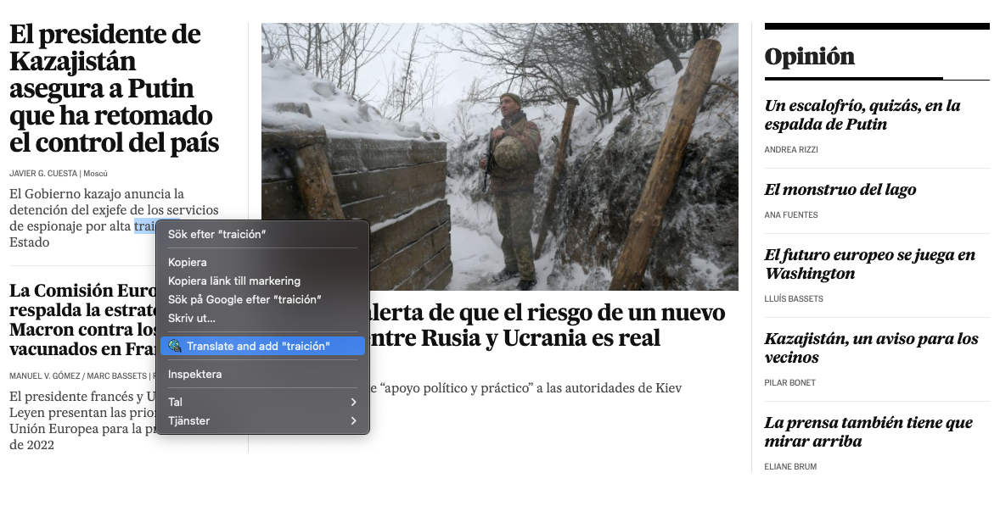
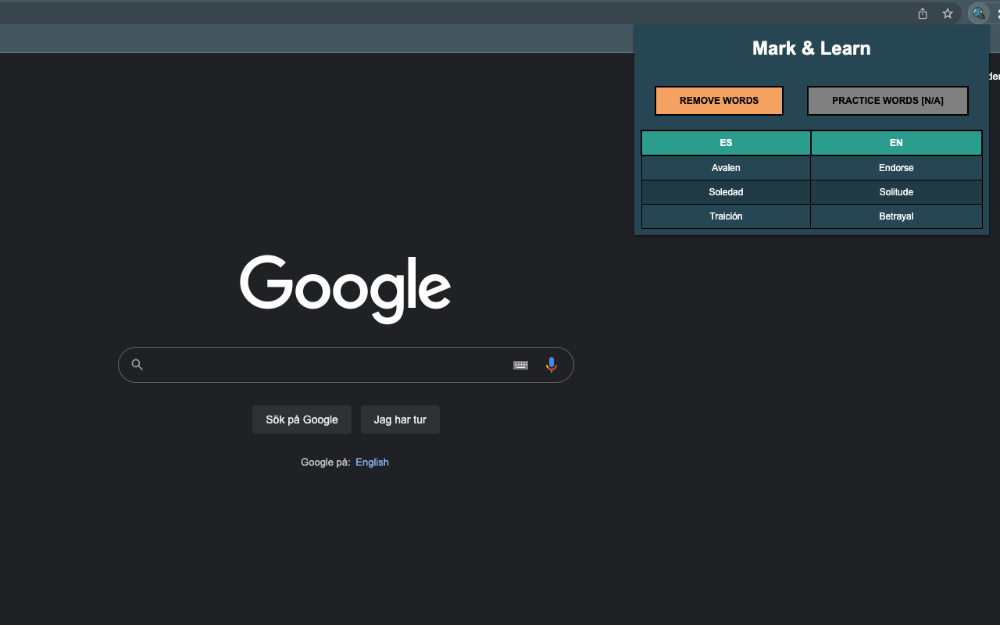

# Mark And Learn
This is a chrome extension that helps you with creating and learning a glossary.

One popular way of learning a new language is to read a lot of texts in that language, news for instance. The Mark And Learn extension makes it easy to save words and their translation into a glossary in the browser. All you need to do is to highlight the word and save it, the word will then be translated and stored in the glossary for you to later practice.

**Highlight the word**

**View your glossary**

## Installation

### Chrome Web Store
Currently, the Mark And Learn extension is being reviewed. The extension is therefore not available in the chrome web store yet.

### Install it manually
1. Clone the repo
2. Go to `chrome://extensions` in chrome
3. Click “Load Unpacked Extension”
4. Navigate to the local folder containing the source code

### Configuration
Once the extension is installed, you need to configure it a tiny bit. 

First of all, Mark And Learn use [DeepL](https://www.deepl.com/) as the translator engine. DeepL provides a free tier API where one is allowed to translate 500K characters each month. You will need to register for the free tier API to get your API key.

Go to the options page for the extension (right-click on the extension icon), and insert your API key. You can also configure the language that you want to translate from and translate to.

## Post Beta

There are a few things to improve. 

1. Make the configuration simpler, it should not be required for the user to get their API key.
2. Add UX and logic for the practice functionality.
3. Improve storage solution.
   1. If the chrome storage is sufficient, go from `local chrome storage` to `synced chrome storage`.
   2. Change to a real database.
4. Error handling and add tests.
5. Release workflow in Github Actions.

# Contribute?
Feel free to create issues and PRs!
